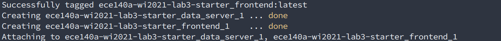
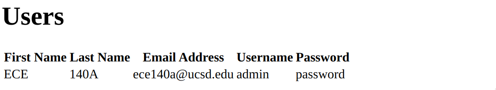
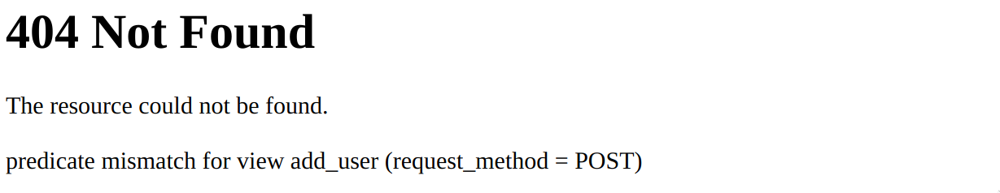
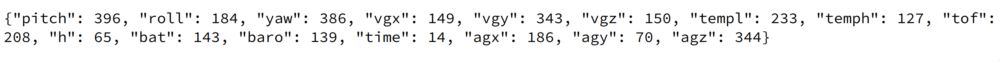

# Lab 3 - Get some REST

*There are a lot of moving parts to this lab, please read through the entire write up and get a big picture before starting.*

## Due Date

Jan 29th Friday 11:59PM PST

## Prerequisites

1) Video lecture on [HTML](https://www.youtube.com/watch?v=Ht5nE2l4mJI)
2) Video lecture on [REST](https://www.youtube.com/watch?v=YHZmSlF-rOU)
3) Video lecture on [Web Serving Fundamentals](https://www.youtube.com/watch?v=5a0R2yiiEeo).
4) Video lectures on Javascript
    1) [Introduction to Javascript](https://www.youtube.com/watch?v=E0_pEASqB3A&feature=emb_title)
    2) [Interactions](https://www.youtube.com/watch?v=Mwf_qU6zQfo)
    3) [Asynchronous javascript + JSON](https://www.youtube.com/watch?v=eusDs93MlnQ)

## What's a REST API?

A REST API is an API that provides a REST interface to interact with.

Cool, what's an API though? Think about when you go to `google.com`, you are presented with an interface. It's got a search form, some buttons, etc... It's an interface designed for humans to interact with. An API on the other hand is an `Application programming interface`, which is for different programs to interact with each other instead of humans. It's software that can interact with other software!

Let's briefly remind ourselves what REST is and what it means for an API to be RESTful.

Remember, REST is simply a collection of **verbs** that have been accepted to provide universal interaction between programs.

What does that mean? Think of an apple, there are different **verbs** that can be applied to it. We can `EAT` it, we can `WASH` it, we can `THROW` it at someone etc... Some verbs make more sense than others on how to interact with an apple.

Now, way back in the year 2000, Roy Felding applied this same concept to web resources (data). He argued there are certain **verbs** that make sense to interact with resources on another machine.

So, a RESTful API will provide an interface to interact with it using the *verbs* below:

`GET` - (HTTP Verb **GET**) -- Which requests a collection of data from a server

> Example routes:
>
> `GET /users` -- Get a list of users
>
> `GET /posts` -- Get a list of all the posts
>
> `GET /posts?userid=1` -- Get a list of all the posts created by user 1

`DELETE` - (HTTP Verb **DELETE**) To request that a collection of data be removed on the server

> Example route:
>
> `DELETE /posts/{post-id}` -- Delete a post with id={post-id}

`POST` - (HTTP Verb: **POST**) Vaguely named method to add data to the server

> Example route:
>
> `POST /posts` -- Ask the server to create a new post. Notice we don't specify a location, or id for the post, this is left to the server!

`PUT` - (HTTP Verb **PUT**) To request that a server update existing data on a server

> Example route:
>
> `PUT /posts/{post-id}` -- Edit/Update a post with id={post-id}

### Examples

#### Python Requests

```python
r = requests.put('https://example.com/path/to/data/to/put', data = {'key':'value'})
```

Will send a `PUT` request to the the `URL` and attach the new data. Please see the [quick start guide](https://requests.readthedocs.io/en/master/user/quickstart/) and the [API reference](https://requests.readthedocs.io/en/latest/api/) for more information on how to build requests!

#### Javascript Fetch

```javascript
fetch('http://example.com/fake_data')
            .then(response => response.json())
            .then(data => console.log(data));
```
Will send a `GET` request to the `URL` and log the response into the console. Please see the [Using Fetch](https://developer.mozilla.org/en-US/docs/Web/API/Fetch_API/Using_Fetch) from MDN web docs for more information.
## Overview

The goal of this lab is to become more comfortable with web serving and REST fundamentals. We are going to create a simple server, that we will call `frontend`. Our `frontend` (server) will provide a user with an interface to make REST calls to another server called `backend`. The `backend` (server) will contain two JSON database's with which we can interact. The first contains user information while the second contains flight information for a Tello drone.

Both servers have already created for you. They are similar to what you have already seen, the only difference is there are now two of them and they have been tied together using Docker Compose.

We can start the container containing both servers using:
     `docker-compose up --build`.

When that's finished you'll see something similar to:



Now, open up your browser and go to `0.0.0.0:6543`, or if that doesn't work, you might need to use `localhost:6543`. You should see your browser display:


Now try going to `localhost:6543/show_users` and you'll see:



This route sends a `GET` request to the `backend` which returns a list of all users stored in the JSON database!

One other route has been partially pre-made for you; `/add_user`. However, you'll notice if you go to this route directly, you'll see:



This is because there was no data included in a `POST` request and the route expects a `POST` with appropriate data to populate the database. Also, we have not defined what to do after a user has been added. This is for you to implement!

Now, try going to `localhost:5001/fake_data`. You should see something similar to:


This returns fake Tello state data, identical to that in `tello_moves_database.txt`.

Your task will be to create a route `show_tello_moves` which `GET`s the contents of `tello_moves_database.txt` and creates a table similar to `show_data`. Javascript will also be utilized to dynamically update the table with new data!

There are two routes which will be fully your responsibility:

1) A route which uses the HTTP **verb** `PUT` to send a request to the `backend` server to edit a current user in the user database.
2) A route which uses the HTTP **verb** `GET` to send a request to the `backend` server to get all moves contained therein. You may model the implementation after the `show_users` route. Again, Javascript will also be utilized to dynamically update the table with new data by making a REST `GET` call to the backend server.

## Challenges

### Challenge 1

Right now, when you visit `localhost:6543` you'll notice there is no way to navigate to the `view_users` page (unless you enter the URL directly), add a new user, edit a user, or view the contents of `tello_moves_database.txt`. It is up to you to provide the user with an interface to do these tasks. There are no restrictions on implementation.

For example, you could add a button on the homepage that directs you to view the users and edit them, another button that allows to add a new user or any other way you wish!

### Challenge 2

Complete implementation of the `add_user` route. You will need to create a form and submit a `POST` request to the `backend` server for insertion into the database.

### Challenge 3

Using the other routes as reference, implement a new route `/edit_user` which allows for editing of a current user in the JSON database. You can make changes to the `users.html` template to achieve this, or create your own page.

### Challenge 4

#### 4.1

On the `frontend` server, implement a new route; `show_tello_moves` which retrieves and displays the contents of `tello_moves_database.txt`, similar to `show_users`. You will need to make appropriate changes on the `backend` server as well.

#### 4.2

Next, using **Javascript** you will dynamically update the table with new moves using data from the `/fake_data` route on the `backend` server. Update the table with fake data every 3 seconds.

### Challenge 5 (Optional)

You'll also notice that there is no `CSS` used and as a result everything looks very ugly... Add some of your personality to the UI using the included `lab3.css` file in the public folder of the `frontend` server to make the site more visually appealing! We don't expect you to be expert designers but we do expect some effort.

You can see the [Introduction to CSS](https://www.youtube.com/watch?v=TyuH8crgiRg) video for a preview of what's to come!

#### Route Summary

A `GET` route `/show_users` has been fully completed for you and is ready for use.

A `POST` route `/add_user` has been partially implemented.

A `PUT` route `/edit_user` is completely up to you to implement.

A `GET` route `/show_tello_moves` is completely up to you to implement.

A `GET` route `/fake_data` has been fully implemented and is ready for requests.

> **Make sure to use the exact routes listed above, we will be only running and testing these routes.**

## Deliverables

1. Functional User Interface to navigate any necessary pages to complete the above tasks.
2. Ability to add a new user.
3. Ability to edit an existing user.
4. Display contents of `tello_moves_database.txt` and update in real time with fake data. 
5. (Optional) Implemented CSS on the lab3.css file, to make it look visually appealing. *[Challenge 5]*
6. Submit via github

**NOTE: You will need to stop and restart the container when you make changes to the code. You may also need to [bypass the browser cache](https://en.wikipedia.org/wiki/Wikipedia:Bypass_your_cache) to see changes in `HTML` or `CSS`.**

Due date:
Jan 29th Friday 11:59PM PST

Good Luck!!
